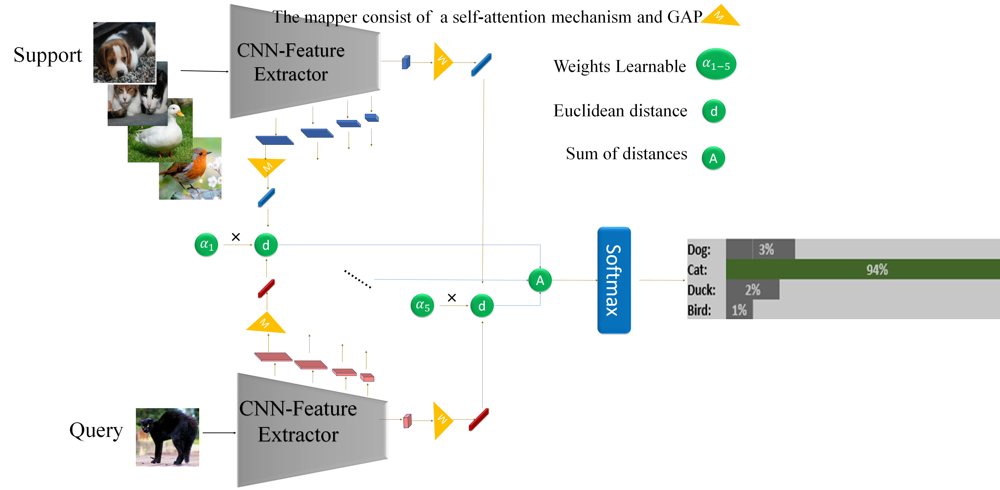

# Fewshot_Imageclassification
Implementation of a Few-Shot Image Classification Model based on the Prototypical Network Model and Tested on the MiniImagenet and NWPU-RESISC45 Datasets.

## Table of Contents

## Project Description

In this project, we propose an enhanced model for few-shot image classification based on the Prototypical model. Our main objective is to improve the accuracy of the model through various techniques such as modifying the backbone architecture, employing multiple embedding spaces, assigning weight parameters to each output vector, and incorporating self-attention mechanisms.

We evaluate the effectiveness of our approach on the MiniImagenet training dataset, comparing our results with existing models described in relevant papers. Specifically, we focus on two tasks: 5-way 5-shot and 5-way 1-shot. In the 5-way 5-shot task, we achieve an accuracy of 84.42%, while in the 5-way 1-shot task, we achieve an accuracy of 64.46%.

Furthermore, we demonstrate the generalizability of our model by testing it on an unseen dataset without prior training and observe good accuracy. Overall, this project contributes to the field of few-shot image classification by presenting an improved model and demonstrating its superior performance in addressing the challenges of few-shot learning tasks.

## Model

Our model consists of the following components:
1. We employed different feature spaces and extracted feature maps at five stages to capture both global and task-specific features.
2. We integrated learnable parameter weights at each stage.
3. We utilized a self-attention mechanism for each feature map obtained from every stage to capture more valuable information.

The final model architecture is as follows:

## How to run

## Results

## Refrences